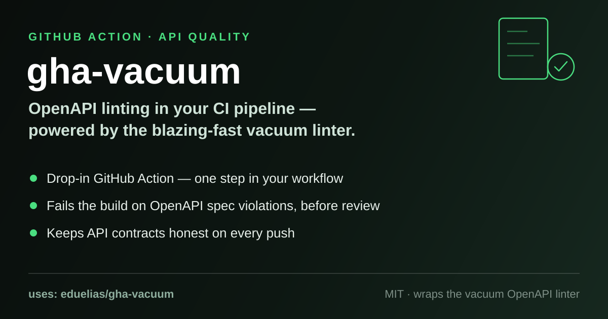

# gha-vacuum

<p align="center">
  
</p>

<p align="center">
  <a href="LICENSE"></a>
  <a href="https://quobix.com/vacuum/"></a>
</p>

A minimal GitHub Action that lints your OpenAPI specs with
[**vacuum**](https://quobix.com/vacuum/) — the world's fastest OpenAPI/Swagger
linter, built by [Dave Shanley / pb33f](https://pb33f.io/). It installs the
latest vacuum release on the runner and runs the exact vacuum command you give
it. Nothing more, nothing less.

Break the build on broken specs, before they break your consumers.

## Features

- **Fast** — vacuum lints large OpenAPI 3.x / Swagger specs in milliseconds.
- **Zero setup** — one step installs vacuum and runs it; no Docker image to
  pull, no toolchain to configure.
- **Full control** — you pass the complete vacuum command, so every vacuum
  flag, ruleset and subcommand (`lint`, `report`, `spectral-report`, …) is
  available. No wrapper options to learn or outgrow.
- **Composite action** — plain bash on the runner, easy to audit
  ([`action.yaml`](action.yaml) is 17 lines).

## Usage

```yaml
name: Lint OpenAPI spec

on:
  pull_request:
  push:
    branches: [main]

jobs:
  lint:
    runs-on: ubuntu-latest
    steps:
      - uses: actions/checkout@v4

      - name: Lint OpenAPI spec with vacuum
        uses: eduelias/gha-vacuum@v0.0.1
        with:
          cmd: vacuum lint -d openapi.yaml
```

`cmd` is any vacuum invocation. A few useful variants:

```yaml
# Show every issue in detail, fail the build on errors
cmd: vacuum lint -d -e api/openapi.yaml

# Use your own ruleset
cmd: vacuum lint -r rules/my-ruleset.yaml api/openapi.yaml

# Lint multiple specs
cmd: vacuum lint specs/*.yaml
```

See the [vacuum documentation](https://quobix.com/vacuum/) for all commands and
flags.

## Inputs

| Name  | Description                                            | Required | Default |
|-------|--------------------------------------------------------|----------|---------|
| `cmd` | Vacuum command, see <https://quobix.com/vacuum/>       | yes      | —       |

There are no outputs; the job fails when the vacuum command exits non-zero.

## How it works

Two steps, both plain bash:

1. Install the latest vacuum release via the official install script
   (`https://quobix.com/scripts/install_vacuum.sh`).
2. Run your `cmd` as-is on the runner.

Because the command runs in a shell, it requires a Linux or macOS runner
(`ubuntu-latest` recommended).

## Credits

All the heavy lifting is done by [**vacuum**](https://quobix.com/vacuum/),
created by [Dave Shanley](https://github.com/daveshanley) at
[pb33f](https://pb33f.io/). This action just gets it onto your runner. Go star
[daveshanley/vacuum](https://github.com/daveshanley/vacuum).

## License

MIT — see [`LICENSE`](LICENSE).

## Contributing

Contributions are welcome! Please read [`CONTRIBUTING.md`](CONTRIBUTING.md).
